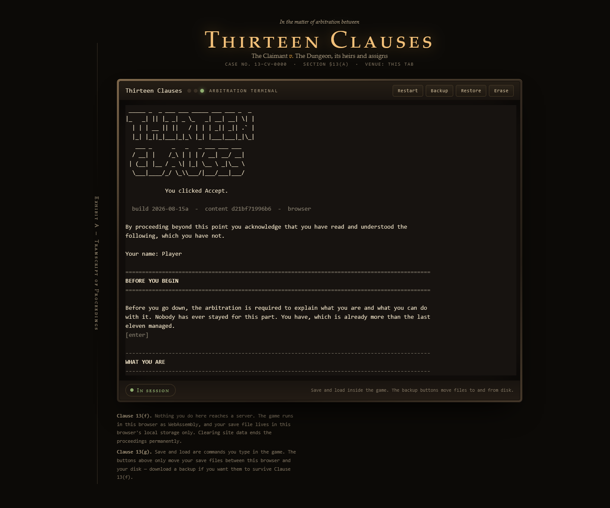
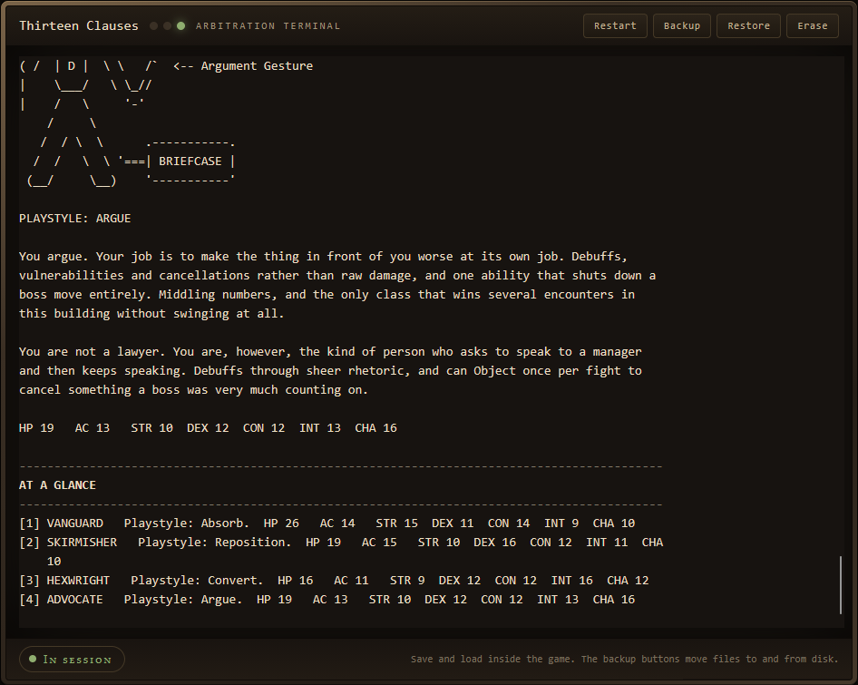
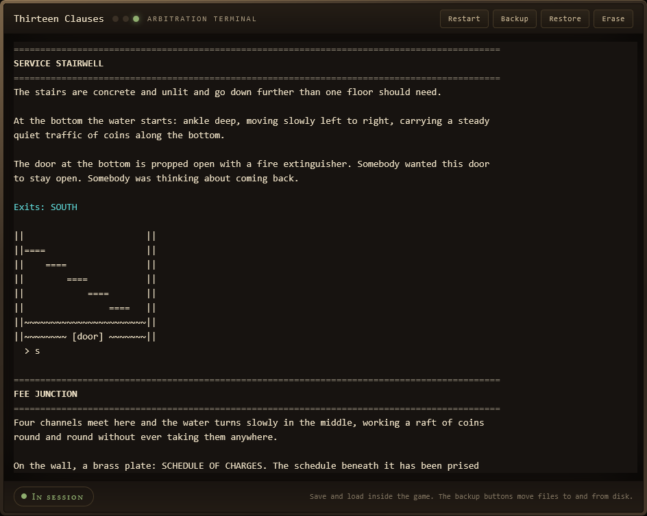
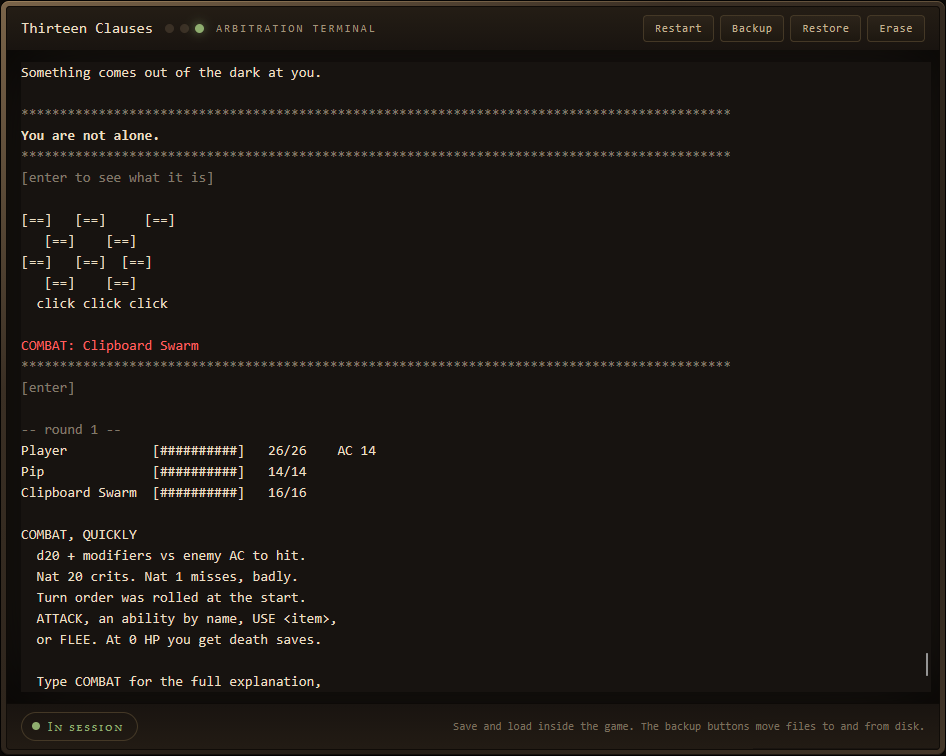
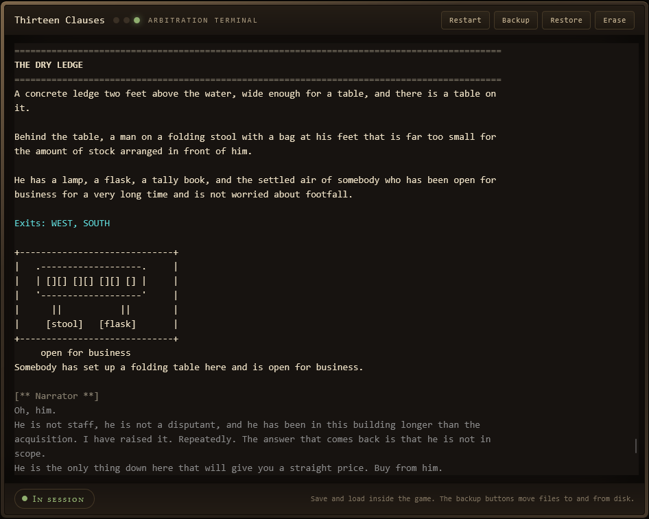
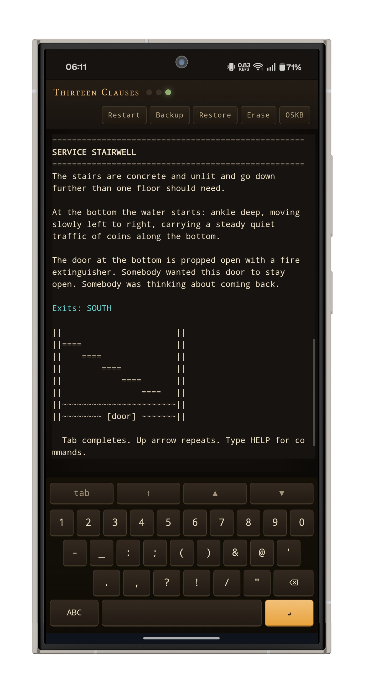

# Thirteen Clauses

A text dungeon crawler about binding arbitration.

You have a dispute. The other party has a dungeon. Thirteen floors of it, and a
clause for every one. Fight your way down, or read the small print carefully
enough to find another way out.

Plays in a terminal or in a browser. No install, no account, no server — the
browser version runs the same Python as the terminal version, compiled to
WebAssembly, entirely in your tab.

<!-- Screenshot: the title screen and case caption -->


---

## Play it

**In a browser** — open the hosted page, or serve the folder yourself
(see [WRAPPER.md](WRAPPER.md)). Nothing to install.

**In a terminal** — Python 3.10 or newer, standard library only, no
dependencies:

```
git clone https://github.com/<you>/thirteen-clauses.git
cd thirteen-clauses/python
python3 play.py
```

Useful flags:

```
python3 play.py --seed 1234      # a reproducible run
python3 play.py --new            # skip the menu
python3 play.py --load           # resume the most recent save
python3 play.py --width 46       # force screen width
```

If you are on a phone terminal like Pydroid or Termux and the ASCII art looks
broken, that is the terminal misreporting its width. Pass `--width 46` or type
`width 46` in game.

---

## Starting a run

You pick a name, a class and a companion, and the building gives you a briefing
on the way in. Four classes, each with a different answer to being hit:

| Class | Plays like | Leans on |
|---|---|---|
| **Vanguard** | Absorb | Strength, Constitution |
| **Skirmisher** | Reposition | Dexterity |
| **Hexwright** | Convert | Intelligence |
| **Advocate** | Argue | Charisma |

Four companions come along — **Pip**, **Grunk**, **The Cube** and **Bartleby**.
Each is good at something different, and each of them has opinions.

<!-- Screenshot: class selection with the stat summary -->


---

## How it plays

Type commands. `help` lists them all in game; the essentials are:

```
n s e w      move                look         describe the room again
take         pick something up   talk         speak to whoever is here
map          where you have been rest         recover, in safe rooms only
inv          inventory           sheet        your character page
use <item>   use something       equip <item> weapon or armour
save [name]  save                load         resume
```

**Exploring.** Thirteen hand-built floors, not generated ones. Rooms have exits,
things worth picking up, people worth talking to, and notes worth reading. Some
floors do something to the building itself while you are on them.

**Combat** is d20 and dice damage, turn order, and death saves when you go down.
`attack` swings at the nearest thing; `attack 2` picks one out when several
share a name. `ability` lists what you can do and how many uses you have left,
and typing an ability's name is a shortcut. `flee` works, but survivors follow
you.

**Abilities** are granted as you level, per class. There are 36 of them.

**Money and stalls.** A salesman turns up once a floor from the second floor
onward, and he is always already there. He sells what runs out, buys your junk
back at a third, and will fit you a bigger bag for escalating amounts. Charisma
moves his prices either way.

**Minigames.** Some encounters are not fights. Blackjack, dice, hangman,
noughts and crosses, rock-paper-scissors, and one that is harder to describe.

**Levelling** runs to 25 across the thirteen floors, and hit points cap at 350.
A thorough run tops out on the last floor; a brisk one will not, which is the
point.

<!-- Screenshot: a room description with exits and an item -->


<!-- Screenshot: a combat round showing the dice and the roster -->


---

## Pacing, width and effects

The game is meant to be read, so it paces itself. Three settings, changeable at
any time:

```
pace slow      a short pause between turns (default)
pace fast      print each round at once, skip every press-Enter break
pace manual    press Enter between turns
```

Some floors raise a visual effect on arrival — weather, light, interference,
that sort of thing. In a terminal these are drawn in ANSI; in a browser the page
paints them over the terminal. `effects off` turns the lot off and the setting
survives a save. Everything respects `prefers-reduced-motion`, and nothing
animates in the range that triggers photosensitive reactions.

`width <n>` forces the screen width if your terminal is lying about it.

<!-- Screenshot: a stall, stock list and prices -->


---

## Saves

Save and load are commands you type in the game — `save`, `save <name>`, `load`,
`load <name>`. In a terminal, saves go to `python/saves/` as `.13save` files:
gzipped JSON in a text envelope, so they survive being emailed or pasted.

In a browser they go to that browser's local storage, and clearing site data
deletes them. The **Backup** and **Restore** buttons in the console bar move
them between the browser and your disk — use Backup if you want a save to
outlive a cleared cache.

Nothing you do reaches a server. There is nowhere for it to go.

---

## On a phone

The browser version ships its own on-screen keyboard, because mobile browsers
cannot reliably raise the real one over a terminal. The **OSKB** button in the
console bar switches between that and your device keyboard, and remembers which
you picked. It also installs to the home screen as a PWA.

<!-- Screenshot: the on-screen keyboard on a phone -->


---

## What is in here

```
index.html  app.js  worker.js  sw.js  effects.js   the browser wrapper
styles.css  effects.css  keyboard.css             its styles
python/                                           the game itself
python/engine/                                    rules, no I/O
python/frontends/terminal/                        the terminal renderer
python/content/                                   floors, monsters, items, text
docs/screenshots/                                 images used by this file
```

The engine does no input or output at all: `step()` takes an action and returns
a list of events, and a frontend renders them. That is why the same code runs in
a terminal and in a browser without knowing which it is in.

Content is JSON — 13 floors, 105 monsters, 101 items, 36 abilities and 180
pieces of ASCII art — so most of the game can be changed without touching
Python.

---

## Documentation

| File | What it covers | Spoilers |
|---|---|---|
| **README.md** | this file — what the game is and how to play it | none |
| **[WRAPPER.md](WRAPPER.md)** | the browser wrapper: page, worker, hosting, deployment, security | none |
| **[python/SPOILERS.md](python/SPOILERS.md)** | the full design document: every floor, secret and ending | **all of them** |
| **[python/EFFECTS.md](python/EFFECTS.md)** | the event contract for a wrapper painting its own effects | some |

`python/SPOILERS.md` is named that for a reason. It is the reference for anyone
working on the game, and it gives away the entire thing.

---

## Running the tests

```
cd python
python3 tools/validate.py     # content: every key, exit and table resolves
python3 tests/smoke.py        # 60 bot playthroughs, checks nothing crashes
python3 tests/regressions.py  # the named behaviours that have broken before
```

All three exit non-zero on failure. `python3 build.py` from the repository root
regenerates `python/manifest.json`, which lists the files the browser copies
into its sandbox — run it after adding or removing anything under `python/`.

---

## Credits and licence

**MIT** — see [LICENSE](LICENSE). Use it, change it, ship it; keep the notice.

The two third-party components are loaded from a CDN at runtime and pinned by
version, not redistributed here, so their terms are separate from this
project's: [Pyodide](https://pyodide.org) is Mozilla Public License 2.0 and
[xterm.js](https://xtermjs.org) is MIT. If you vendor either of them into your
own copy, their licences travel with the files.
